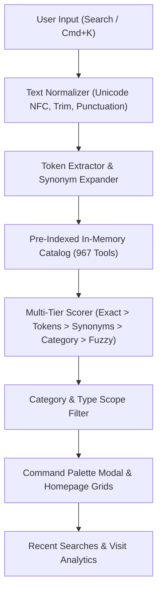

# SSDK TOOLS HUB — Search & Discovery Architecture Reference

## 1. High-Level Architecture Overview

The SSDK Tools Hub Search & Discovery system coordinates fast, client-side indexing, query tokenization, category-aware ranking heuristics, and contextual tool recommendations across the 967-tool catalog.

## 2. Core Search Components

1. **`core/search/engine.js` (`SearchEngine`)**:
   - Manages pre-built in-memory search index created from `ConfigEngine.getTools()`.
   - Tokenizes and normalizes queries into normalized search vectors.
   - Applies 100+ universal synonyms and domain expansions.
   - Calculates Levenshtein edit distance for typo tolerance.
   - Provides autocomplete suggestions and manages recent searches in LocalStorage.

2. **`core/discovery/recommendation-engine.js` (`RecommendationEngine`)**:
   - Computes multi-dimensional similarity matrices for related tools on individual workspace pages.
   - Scores candidates based on category match, subcategory alignment, shared name tokens, tag/keyword overlap, and media input/output compatibility.
   - Suggests contextual next-step tools for both anonymous and logged-in users.

3. **`core/bootstrap.js` (`bindCommandPaletteSearch`)**:
   - Manages global keyboard shortcuts (`Ctrl+K`, `/`, `ESC`, `ArrowUp`, `ArrowDown`, `Enter`).
   - Implements 120ms debounced input listeners for smooth, responsive UX.
   - Connects interactive filter chips (Image, PDF, Dev, Medical, AI).
   - Renders interactive typo recovery pills ("Did you mean...").

4. **`engines/homepage-engine.js`**:
   - Mounts hero search, category discovery bars, and real-time filtered views.
   - Renders Popular, Trending, and Curated Tool Collections.

## 3. Search Ranking Weights

| Priority Tier | Match Condition | Base Weight | Description |
|---|---|---|---|
| Tier 1 | Exact Name / ID Match | +2000 | Direct exact match with tool identifier or display name |
| Tier 2 | Name Starts With Query | +1200 | Tool name begins with query prefix |
| Tier 3 | Name Contains Query | +900 | Substring match inside tool name |
| Tier 4 | Full Token Coverage | +600 | All query tokens appear across tool metadata |
| Tier 5 | Synonym / Alias Match | +500 | Query matches synonym dictionary entry |
| Tier 6 | Category Hint Match | +300 | Query indicates primary category (e.g. "image", "pdf") |
| Tier 7 | Individual Token Match | +350 / +200 | Matched tokens in aliases, keywords, or tags |
| Tier 8 | Description Match | +80 | Token found in long-form tool description |
| Tier 9 | Fuzzy Typo Match | +140 to +200 | Levenshtein edit distance <= 2 |
| Tier 10 | Popular / Featured Bonus | +10 to +20 | Tiebreaker signal |
